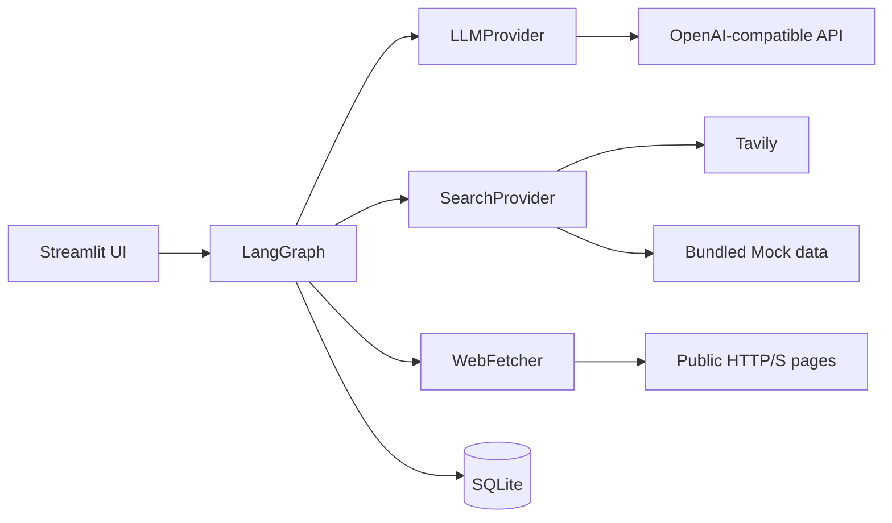
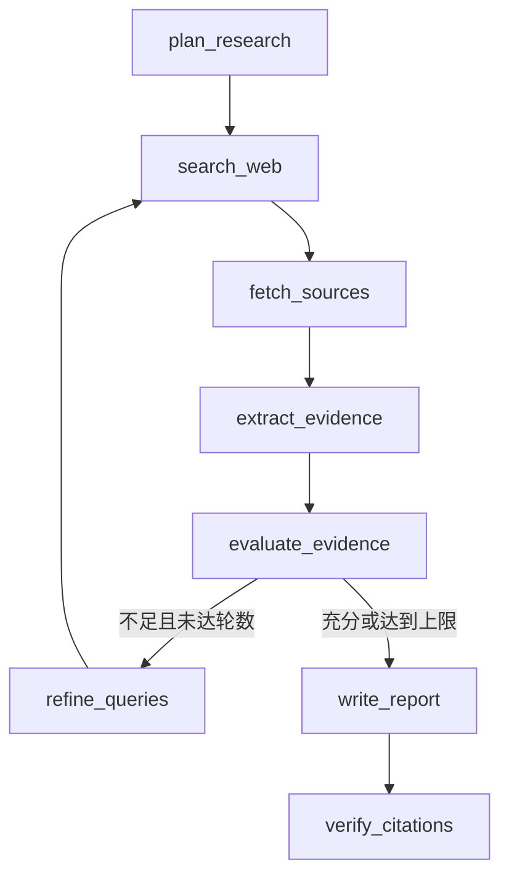

# EvidencePilot

EvidencePilot 是一个开源的“可验证深度研究 Agent”Demo。输入技术问题后，它会规划子问题、并发搜索和抓取网页、提取带来源 ID 的证据、评估证据缺口、进行至多若干轮补充研究，最终生成带可点击引用的 Markdown 报告并逐条核验引用。

> 截图占位：启动 Streamlit 后，可在此处替换为 `docs/screenshot.png`。当前界面包含运行进度、研究报告、过程与来源、引用核验三个视图。

## 架构



工作流由以下 LangGraph 节点构成：



默认最多两轮，UI 可选择 1–3 轮。查询、URL、相似标题和证据均去重；页面抓取限制协议、目标 IP、大小、超时和正文长度。单个搜索或抓取失败会记录并尽可能继续。SQLite 使用显式存储层，避免 LangGraph checkpointer 版本耦合，保存任务状态、来源、报告、节点运行和错误。

## 本地安装

需要 Python 3.11+。推荐使用 [uv](https://docs.astral.sh/uv/)：

```bash
uv sync
cp .env.example .env
uv run streamlit run frontend/streamlit_app.py
```

安装后也可以使用正式 CLI：

```bash
uv run evidencepilot providers
uv run evidencepilot research "你的研究问题" --max-rounds 2
uv run evidencepilot inspect <task-id>
uv run evidencepilot resume <task-id>
uv run evidencepilot eval
```

也可使用标准 pip：

```bash
python3.11 -m venv .venv
source .venv/bin/activate
pip install -e .
streamlit run frontend/streamlit_app.py
```

## 环境变量

| 变量 | 必需 | 说明 |
|---|---:|---|
| `LLM_PROVIDER` | 是 | `openai`、`deepseek` 或显式离线 `mock` |
| `SEARCH_PROVIDER` | 是 | `tavily` 或显式离线 `mock` |
| `OPENAI_API_KEY` | 真实 LLM 必需 | OpenAI 或兼容 API 密钥；缺失时直接报配置错误 |
| `OPENAI_BASE_URL` | 否 | OpenAI-compatible base URL；DeepSeek 使用 `https://api.deepseek.com` |
| `OPENAI_MODEL` | 否 | DeepSeek V4 Flash 使用 `deepseek-v4-flash` |
| `LLM_THINKING_MODE` | 否 | `disabled` 或 `enabled`；默认 `disabled` |
| `LLM_REASONING_EFFORT` | 否 | 仅思考模式开启时传递，默认 `low` |
| `LLM_MAX_TOKENS_STRUCTURED` | 否 | 计划、提取、评估、核验等结构化节点的上限，默认 `2048` |
| `LLM_MAX_TOKENS_REPORT` | 否 | 报告节点的输出上限，默认 `4096` |
| `LLM_TIMEOUT_SECONDS` | 否 | 单次模型请求超时，默认 `120` |
| `LLM_MAX_RETRIES` | 否 | 429、500、503 与网络超时的最大重试数，默认 `2` |
| `TAVILY_API_KEY` | Tavily 必需 | 缺失时直接报配置错误，不会静默切换 Mock |
| `EVIDENCEPILOT_DB` | 否 | 默认 `data/evidencepilot.db` |

密钥只从环境读取，不应提交 `.env`。日志与持久化层均不保存密钥。

### DeepSeek V4 Flash

```env
OPENAI_API_KEY=
OPENAI_BASE_URL=https://api.deepseek.com
OPENAI_MODEL=deepseek-v4-flash
LLM_THINKING_MODE=disabled
LLM_REASONING_EFFORT=low
LLM_MAX_TOKENS_STRUCTURED=2048
LLM_MAX_TOKENS_REPORT=4096
LLM_TIMEOUT_SECONDS=120
LLM_MAX_RETRIES=2
```

DeepSeek V4 默认开启思考；EvidencePilot 显式关闭它，因为计划、证据提取、充分性评估和引用核验依赖完整、可校验的 JSON，关闭思考可避免 reasoning 占满输出预算。开启时才发送 `reasoning_effort`，且不会发送或依赖 temperature、top_p。业务只使用 `message.content`；完整 `reasoning_content` 不进入日志、SQLite、Streamlit 或测试快照，仅记录 API 提供的 reasoning token 数。

节点预算由配置层集中管理：计划和证据提取 2048、充分性评估 1536、补充查询 1024、引用核验 2048、报告 4096。`LLM_MAX_TOKENS_STRUCTURED` 会作为结构化节点总上限。

## Mock 与全真实模式

Provider 必须显式选择。缺少真实 Provider 的密钥会立即失败，不会静默降级。

完全离线模式使用固定资料且不会产生 API 成本：

```env
LLM_PROVIDER=mock
SEARCH_PROVIDER=mock
```

```bash
uv run pytest
```

真实模式请在 `.env` 填入 `OPENAI_API_KEY`（以及兼容服务所需的 `OPENAI_BASE_URL`、`OPENAI_MODEL`）。再填入 `TAVILY_API_KEY` 即启用真实网页搜索；不填则保留 Mock 搜索、使用真实模型。

- Mock：必须显式配置；Fake LLM + bundled Mock search，免费、确定性。
- 全真实：真实 DeepSeek + Tavily + HTTP 抓取；需要两个有效密钥，产生外部 API 成本。

## 可恢复执行

初始状态和每个已完成节点都会写入 SQLite。失败或进程中断后可从最后失败节点继续：

```bash
uv run python scripts/resume_task.py <task-id>
```

已完成任务再次恢复会直接返回现有状态，不会重复调用 Provider。

## 固定质量评测

默认评测只使用 `evals/citation_cases.jsonl`，并按照
`evals/thresholds.json` 执行回归门槛；它不访问模型或搜索 API：

```bash
uv run python scripts/run_evals.py
```

显式使用真实模型评估固定语料的 semantic verdict：

```bash
uv run python scripts/run_evals.py --live-model
```

受限验收命令（最多一轮、3 查询、每查询 3 结果、5 来源，产物写入已忽略的 `artifacts/`）：

```bash
set -a
source .env
set +a
uv run python scripts/run_acceptance.py
```

## 测试

```bash
uv run pytest
```

默认测试不调用真实模型、搜索或网页，覆盖 Provider 显式配置、搜索/查询去重、逐跳 SSRF 校验、Markdown AST、引用核验、局部 Patch、失败恢复以及 Mock 端到端工作流。

显式的小规模付费连通测试默认 skip；确认成本后运行：

```bash
RUN_LIVE_TESTS=1 uv run pytest -m live
```

### 常见 API 错误

- 401：检查 `OPENAI_API_KEY` 是否有效。
- 402：账户余额不足，需要充值或更换可用账户。
- 422：模型名、thinking 或其他请求参数与服务不兼容。
- 429：触发限流；系统会指数退避并只进行有限重试。
- 500/503：服务端故障或暂不可用；系统有限重试后给出明确失败。
- `finish_reason=length`：输出已截断，不会当作成功 JSON/报告。错误会指出节点及当前预算；提高 `LLM_MAX_TOKENS_STRUCTURED` 或 `LLM_MAX_TOKENS_REPORT`，同时确认思考模式未耗尽预算。
- 空 `content` 且存在 reasoning：通常表示思考过程用完 `max_tokens`；关闭思考或提高对应节点预算。

## Docker

```bash
docker build -t evidencepilot .
docker run --rm -p 8501:8501 --env-file .env -v evidencepilot-data:/app/data evidencepilot
```

本地运行不依赖 Docker。

## 当前限制

- Mock 资料是用于演示管线的合成固定资料，不代表开放网络研究结果。
- 引用核验判断“来源文本是否支持结论”，不能保证来源本身真实或权威。
- 没有实现 robots.txt 调度、付费墙/JavaScript 渲染和 PDF 专用解析。
- SQLite 适合单实例 Demo；多进程生产部署需要更强的事务与任务队列方案。
- 引用核验基于抓取到的文本与模型判断，不等同于事实真伪认证。

## Roadmap

- 来源可信度、时效性和跨来源矛盾检测
- PDF/论文解析与段落级引用定位
- 可选的 robots.txt/域名速率限制
- 人工调整研究计划和引用修订流程
- 基于真实基准集的引用准确率评测

项目采用 [MIT License](LICENSE)。
