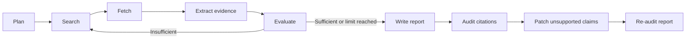

# EvidencePilot

EvidencePilot 是一个强调可验证性的深度研究 Agent。它使用 LangGraph 编排检索、证据提取、报告生成与引用审计，并为报告中的事实保留来源 ID、证据质量和审计结果。

## 核心能力

- 支持 DeepSeek、OpenAI-compatible LLM 与 Tavily Search
- 提供显式 Mock Provider，便于离线开发和确定性测试
- 解析 Markdown Atomic Claim，包括无引用事实句、表格、列表和引用块
- 区分语义支持度与来源获取质量（fetched、snippet fallback、unavailable）
- 使用 source offset 局部修订 unsupported claim，避免全文字符串替换
- 将任务状态、来源、节点记录和指标持久化到 SQLite
- 提供 SSRF 防护、重定向复核、响应大小限制和有限重试
- 提供 CLI、Streamlit 界面与可恢复工作流

## 工作流



来源状态不会被混淆：

- `fetched`：成功获取并解析原始页面
- `snippet_fallback`：抓取失败后保留搜索摘要
- `search_result`：仅保留搜索结果元数据

## 快速开始

需要 Python 3.11+，推荐使用 [uv](https://docs.astral.sh/uv/)。

```bash
uv sync --all-groups
cp .env.example .env
uv run streamlit run frontend/streamlit_app.py
```

然后打开 [http://127.0.0.1:8501](http://127.0.0.1:8501)。

也可以使用 CLI：

```bash
uv run evidencepilot providers
uv run evidencepilot research "你的研究问题" --max-rounds 2
uv run evidencepilot inspect <task-id>
uv run evidencepilot resume <task-id>
uv run evidencepilot eval
```

## 配置

Provider 必须显式选择。缺少真实 API Key 时，程序不会静默降级到 Mock。

```env
LLM_PROVIDER=deepseek
SEARCH_PROVIDER=tavily

OPENAI_API_KEY=
OPENAI_BASE_URL=https://api.deepseek.com
OPENAI_MODEL=deepseek-v4-flash
TAVILY_API_KEY=

SEARCH_TIMEOUT_SECONDS=20
LLM_TIMEOUT_SECONDS=120
LLM_MAX_RETRIES=2
LLM_THINKING_MODE=disabled
LLM_REASONING_EFFORT=low
LLM_MAX_TOKENS_STRUCTURED=2048
LLM_MAX_TOKENS_CITATION_AUDIT=4096
LLM_MAX_TOKENS_REPORT=4096

EVIDENCEPILOT_DB=data/evidencepilot.db
```

常用运行参数：

| 变量 | 默认值 | 说明 |
|---|---:|---|
| `SEARCH_TIMEOUT_SECONDS` | `20` | 单次 Tavily 搜索超时 |
| `LLM_TIMEOUT_SECONDS` | `120` | 单次模型请求超时 |
| `LLM_MAX_RETRIES` | `2` | 模型临时错误的最大重试次数 |
| `LLM_MAX_TOKENS_STRUCTURED` | `2048` | 普通结构化节点输出上限 |
| `LLM_MAX_TOKENS_CITATION_AUDIT` | `4096` | 引用审计输出上限 |
| `LLM_MAX_TOKENS_REPORT` | `4096` | 报告与修订输出上限 |
| `EVIDENCEPILOT_DB` | `data/evidencepilot.db` | SQLite 数据库路径 |

离线模式：

```env
LLM_PROVIDER=mock
SEARCH_PROVIDER=mock
```

## 评测与测试

确定性评测覆盖 32 个固定 case、46 个预期 claim。解析、offset、source set、引用邻接、引用完整性和 Patch 保持性均执行 100% 回归门槛。

```bash
uv run python scripts/run_evals.py
uv run ruff check .
uv run pytest
uv build
```

真实模型语义评测独立运行，不与确定性门槛混合：

```bash
uv run python scripts/run_evals.py --live-model
```

当前语义评测只输出统计结果；建立稳定的重复运行基线后，再在 `evals/semantic_thresholds.json` 中启用硬门槛。

完整真实链路验收会调用 LLM、Tavily 和网页抓取，可能产生 API 成本：

```bash
uv run python scripts/run_acceptance.py
```

## 安全边界

- 网页 Fetcher 仅接受 HTTP/HTTPS 标准端口
- 阻止 URL 凭据、localhost、私网、回环和链路本地地址
- 每次重定向都会重新校验，并拒绝 HTTPS 降级
- Fetcher 不继承环境代理；LLM 与 Search Provider 使用各自客户端配置
- 限制媒体类型、响应大小、超时和并发
- PDF 仅提取文本，不执行嵌入内容
- 日志和持久化层不保存 API Key、完整 reasoning 或完整提示词

DNS 校验与实际连接之间仍存在系统级竞态。生产环境应同时配置出口控制，并在网络层阻断私网和云元数据地址。

## 项目结构

```text
src/evidencepilot/
├── workflow/      # 图编排、节点和路由
├── citations/     # Claim 解析、审计、Patch 和指标
├── retrieval/     # 搜索、抓取和缓存
├── providers/     # Provider 接口与实现
├── storage/       # 存储接口与 SQLite
├── config.py
├── models.py
└── cli.py

frontend/           # Streamlit 界面
evals/              # 固定语料与分层阈值
scripts/            # 评测、验收和恢复工具
tests/              # 离线测试与 opt-in live 测试
```

任务恢复：

```bash
uv run python scripts/resume_task.py <task-id>
```

贡献指南见 [CONTRIBUTING.md](CONTRIBUTING.md)，安全问题见 [SECURITY.md](SECURITY.md)。项目采用 [MIT License](LICENSE)。
