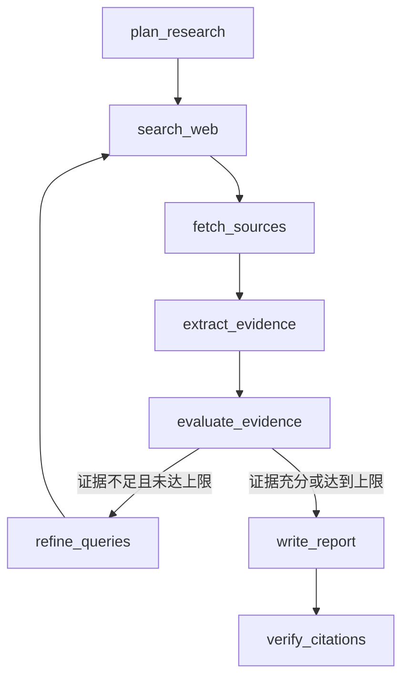

# EvidencePilot

EvidencePilot 是一个可验证的深度研究 Agent。它使用 LangGraph 编排研究计划、搜索、网页/PDF 抓取、证据提取、充分性评估、报告写作和 Citation Audit，并将每条事实与来源 ID 关联。

核心特性：

- 真实 DeepSeek/OpenAI-compatible LLM、Tavily Search 与 HTTP 抓取
- 显式 Mock Provider，支持零成本离线开发和回归测试
- Markdown AST 级 Atomic Claim 解析，引用紧邻事实
- 批量 Citation Audit：区分语义支持与证据质量
- unsupported claim 的结构化局部修订
- SQLite 持久化、任务恢复、节点指标和脱敏运行摘要
- SSRF 防护、响应大小限制、文本型 PDF 解析和有限重试

## 工作流



每个来源分别记录为 `search_result`、`fetched` 或 `snippet_fallback`。抓取失败不会被伪装成成功正文；超时和临时连接错误会在首轮抓取完成后追加一次请求，403、405、SSRF 和解析错误不会重复请求。

## 快速开始

需要 Python 3.11+，推荐使用 [uv](https://docs.astral.sh/uv/)：

```bash
uv sync --all-groups
cp .env.example .env
uv run streamlit run frontend/streamlit_app.py
```

打开 `http://127.0.0.1:8501`。Streamlit 界面支持最大研究轮数、来源类型偏好和最多抓取来源数设置。

也可以直接使用 CLI：

```bash
uv run evidencepilot providers
uv run evidencepilot research "你的研究问题" --max-rounds 2
uv run evidencepilot inspect <task-id>
uv run evidencepilot resume <task-id>
uv run evidencepilot eval
```

## Provider 配置

Provider 必须显式选择；缺少真实密钥时不会静默降级到 Mock。

```env
LLM_PROVIDER=deepseek
SEARCH_PROVIDER=tavily
SEARCH_TIMEOUT_SECONDS=20
OPENAI_API_KEY=
OPENAI_BASE_URL=https://api.deepseek.com
OPENAI_MODEL=deepseek-v4-flash
TAVILY_API_KEY=
LLM_THINKING_MODE=disabled
LLM_MAX_TOKENS_STRUCTURED=2048
LLM_MAX_TOKENS_CITATION_AUDIT=4096
LLM_MAX_TOKENS_REPORT=4096
LLM_TIMEOUT_SECONDS=120
LLM_MAX_RETRIES=2
```

常用配置：

| 变量 | 默认值 | 作用 |
|---|---:|---|
| `LLM_PROVIDER` | 无 | `openai`、`deepseek` 或 `mock` |
| `SEARCH_PROVIDER` | 无 | `tavily` 或 `mock` |
| `SEARCH_TIMEOUT_SECONDS` | `20` | 单次 Tavily 搜索请求超时 |
| `OPENAI_BASE_URL` | OpenAI endpoint | OpenAI-compatible API 地址 |
| `OPENAI_MODEL` | `gpt-4o-mini` | 模型名称 |
| `LLM_MAX_TOKENS_STRUCTURED` | `2048` | 普通结构化节点预算 |
| `LLM_MAX_TOKENS_CITATION_AUDIT` | `4096` | 批量引用核验预算 |
| `LLM_MAX_TOKENS_REPORT` | `4096` | 报告节点预算 |
| `LLM_TIMEOUT_SECONDS` | `120` | 单次模型请求超时 |
| `LLM_MAX_RETRIES` | `2` | 模型临时错误的最大重试数 |
| `EVIDENCEPILOT_DB` | `data/evidencepilot.db` | SQLite 路径 |

密钥只从环境读取。`.env`、数据库、缓存和 `artifacts/` 均不应提交到 Git。

### 离线模式

```env
LLM_PROVIDER=mock
SEARCH_PROVIDER=mock
```

离线模式使用仓库内固定资料，不访问模型、搜索或网页，不产生 API 成本。

## 评测与测试

固定语料评测默认完全离线，并按照 `evals/deterministic_thresholds.json` 对确定性解析指标执行 100% 回归门槛：

```bash
uv run python scripts/run_evals.py
```

显式启用真实模型语义核验；语义统计独立输出，稳定基线建立后再启用硬门槛：

```bash
uv run python scripts/run_evals.py --live-model
```

运行测试：

```bash
uv run ruff check .
uv run pytest
uv build
```

live 测试默认跳过；确认外部 API 成本后再运行：

```bash
RUN_LIVE_TESTS=1 uv run pytest -m live
```

真实验收脚本：

```bash
uv run python scripts/run_acceptance.py
```

## 持久化与恢复

任务状态、来源、报告、节点运行、错误和指标写入 SQLite。失败或中断后可恢复：

```bash
uv run python scripts/resume_task.py <task-id>
```

已完成任务恢复时不会重复调用 Provider。

## 安全边界

- 仅允许 HTTP/HTTPS 和标准端口
- 阻止 URL 凭据、localhost、私网、回环、链路本地和非全局 IP
- 每个重定向重新执行校验，并拒绝 HTTPS 降级
- 网页 Fetcher 禁用环境代理继承（搜索与 LLM Provider 按各自客户端配置）
- 限制响应类型、解码大小、超时和并发
- PDF 只提取文本，不执行嵌入动作或文件
- 日志和持久化层不保存 API Key、完整 reasoning 或完整提示词

DNS 校验与实际连接之间仍存在系统级竞态。生产部署应在网络层阻断私网和云元数据地址，并结合出口控制和域名限流。

## 项目结构

```text
src/evidencepilot/   核心工作流、引用、检索、Provider、存储和 CLI
frontend/             Streamlit 演示界面
scripts/              评测、验收和恢复脚本
evals/                固定质量评测语料与阈值
tests/                离线单元测试和 opt-in live 测试
docs/                 架构与开发文档
```

贡献流程见 [CONTRIBUTING.md](CONTRIBUTING.md)，安全问题请见 [SECURITY.md](SECURITY.md)。项目采用 [MIT License](LICENSE)。
