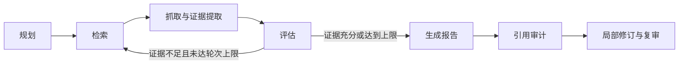

# EvidencePilot

基于 LangGraph 的可验证深度研究 Agent，整合检索、证据提取、报告生成与引用审计，为报告中的事实提供可追溯的来源和审计结果。

## 核心能力

- **证据溯源**：保留来源 ID，区分原文抓取、搜索摘要和搜索元数据，并分别评估语义支持度与来源获取质量。
- **引用审计**：解析正文、表格、列表和引用块中的事实陈述，识别缺失或不受支持的引用，局部修订后再次审计。
- **可恢复工作流**：使用 SQLite 保存任务状态、来源、执行记录和指标，支持 CLI 与 Streamlit 界面。
- **可配置服务**：支持 DeepSeek、OpenAI 兼容接口与 Tavily Search，提供显式 Mock 模式用于离线开发和确定性测试。

## 工作流



## 快速开始

需要 Python 3.11+ 和 [uv](https://docs.astral.sh/uv/)。

```bash
git clone https://github.com/Vonllya/EvidencePilot.git
cd EvidencePilot
uv sync --all-groups
cp .env.example .env
```

在 `.env` 中填写 `OPENAI_API_KEY` 和 `TAVILY_API_KEY`。默认使用 DeepSeek 与 Tavily；模型、接口地址、超时和输出上限等配置见 [.env.example](.env.example)。

如需离线体验，将 `.env` 中的服务设置为 Mock，使用内置测试数据：

```env
LLM_PROVIDER=mock
SEARCH_PROVIDER=mock
```

服务必须显式选择；缺少 API Key 时不会自动切换到 Mock。真实服务调用可能产生 API 费用。

启动 Web 界面：

```bash
uv run streamlit run frontend/streamlit_app.py
```

打开 [http://127.0.0.1:8501](http://127.0.0.1:8501)，或通过 CLI 发起研究：

```bash
uv run evidencepilot providers
uv run evidencepilot research "你的研究问题" --max-rounds 2
uv run evidencepilot inspect <task-id>
uv run evidencepilot resume <task-id>
```

来源名额按最大研究轮数分配，为后续补充检索预留容量；证据充分或来源名额用尽时提前生成报告。

`<task-id>` 为研究命令返回的任务 ID。任务默认保存至 `data/evidencepilot.db`，可通过 `EVIDENCEPILOT_DB` 修改路径。

## 开发与评测

默认测试与固定语料评测离线运行，覆盖事实解析、引用完整性及局部修订等行为：

```bash
uv run ruff check .
uv run pytest
uv run python scripts/run_evals.py
uv build
```

以下检查使用真实服务，可能产生 API 费用：

```bash
uv run python scripts/run_evals.py --live-model  # 模型语义评测
uv run python scripts/run_acceptance.py         # 完整链路验收
```

语义评测默认仅输出统计结果，阈值配置见 [evals/semantic_thresholds.json](evals/semantic_thresholds.json)。开发流程见 [贡献指南](CONTRIBUTING.md)。

## 安全边界

网页抓取限制协议、端口、响应类型与大小，阻止私网等非公网地址，并逐次校验重定向。PDF 仅提取文本；日志与持久化层不保存 API Key、完整推理内容或完整提示词。

DNS 校验与连接建立之间仍存在竞态，生产部署需配置网络出口控制，阻断私网与云元数据地址。详细说明与漏洞报告方式见 [安全政策](SECURITY.md)。

## 项目结构

| 目录 | 内容 |
|---|---|
| `src/evidencepilot/` | 工作流、引用审计、检索、服务接口与存储 |
| `frontend/` | Streamlit 界面 |
| `evals/` | 评测语料与阈值 |
| `scripts/` | 评测、验收与恢复工具 |
| `tests/` | 离线测试与可选真实服务测试 |

项目采用 [MIT License](LICENSE)。版本变更见 [CHANGELOG.md](CHANGELOG.md)。
