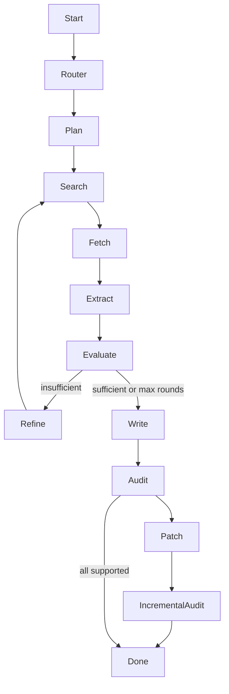

# Architecture

EvidencePilot is a LangGraph workflow with explicit LLM, search, fetch, storage, citation, and observability boundaries.

SQLite stores the initial state, node transitions, sources, errors, report, metrics, and final state. `resume(task_id)` routes a failed or interrupted task back to its last unfinished node. This is application-level durable execution rather than a LangGraph-native checkpointer.

Search results, fetched bodies, and snippet fallbacks remain distinct. Fetched sources record final URL, status, content type, retrieval time, content hash, parser, and quality score. Citation semantic verdict and transport quality are evaluated separately.

Markdown is parsed with `markdown-it-py`. Atomic claims retain AST node type and source offsets, allowing local patches without global string replacement.
